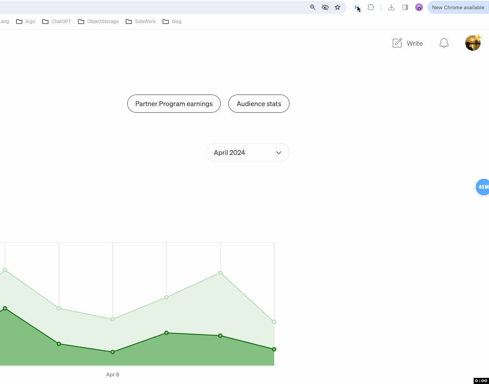
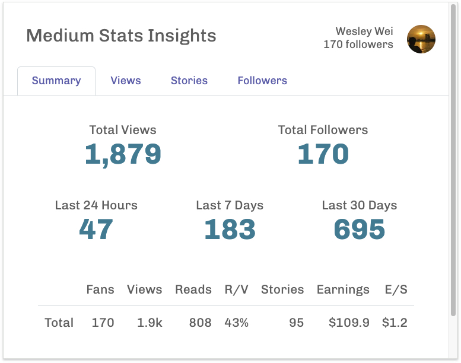
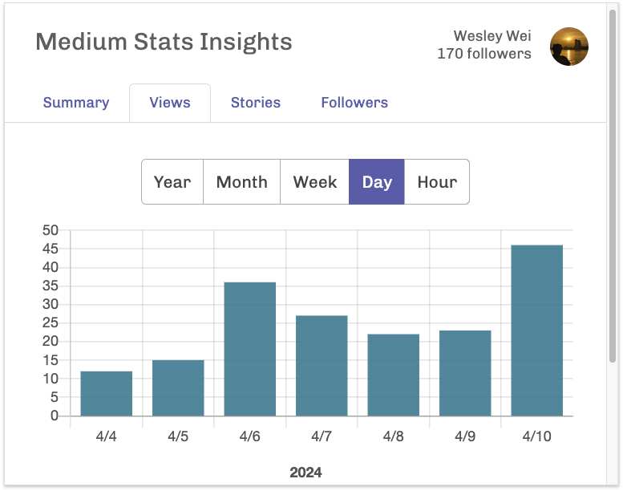
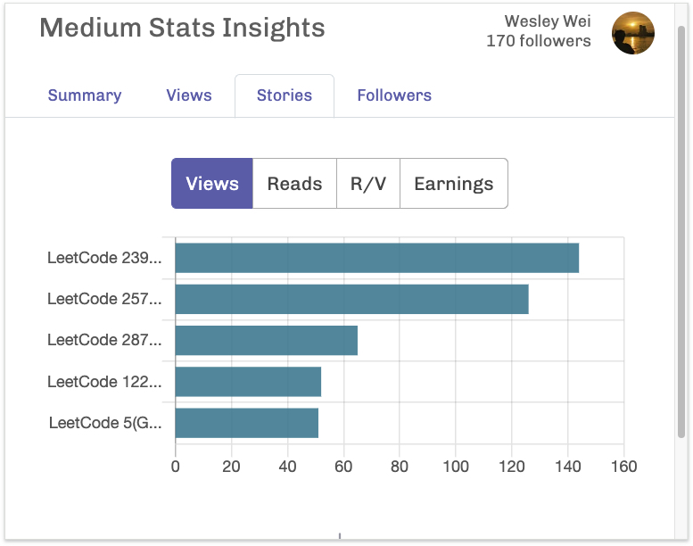
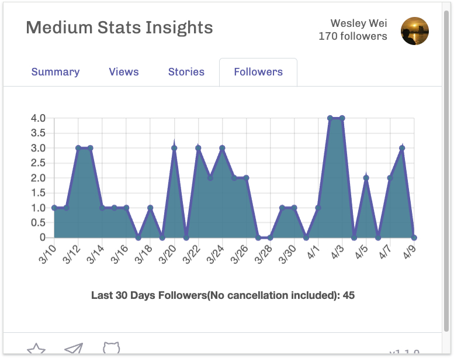

# Medium Stats Insights

Medium Stats Insights is a chrome extension that help writers on Medium get more insights from the stats. You can add it to your chrome via [this link](https://chromewebstore.google.com/detail/medium-stats-insights/ajgkoiodkljabcgempdllhgkglaiipjb).

## Usage

1. Step 1: Log in to your Medium account
2. Step 2: Click the icon
3. Step 3: Get the stats!

<!--  -->

## Features

-  A summary contains total views, total followers, total earnings, last 24 hours/ 7 days/ 30 days views
-  Views of all articles in 4 different timespans: year, month, week, date, hour
-  Sort your TOP 5 articles by different metrics such as views, reads, r/v, earnings
-  Last 30 days new followers(No cancellation included) trend

### Summary Stats

### Views Stats

### Stories Stats

### Follower Trend

## Thanks 

[better-medium-stats](https://github.com/HcwXd/better-medium-stats)

## Third Party

- [Chart.js](https://www.chartjs.org/)

## Stargazers over time

## Buy Me a Coffee

